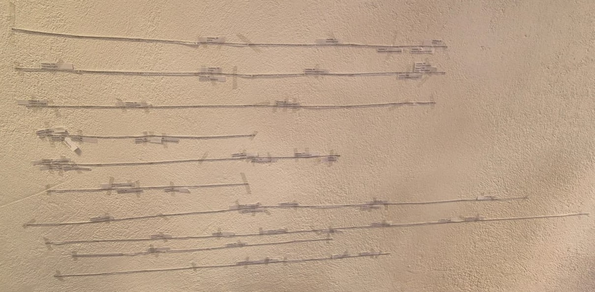

```{r setup, include=FALSE}
knitr::opts_chunk$set(echo = TRUE)
```

#


[Base de datos](../Data/RNA-seq_a_mano-2.pdf)

Se llevó a cabo el analisis de expresión de genes a partir de short reads (200 subsets) para identificar el nivel de expresión de 10 genes especificos. Se realizo con 2 metodologias:

- A mano

Se imprimieron los 10 genes de forma lineal para posteriormente encontrar los lugares de coincidencia de los short reads, para finalmente contar cuantas coincidencias correspondian a cada gen.



- Script en R

Para llevar a cabo el analisis en R se va a utilizar el paquete BioStrings de BioConductor, ya que vamos a usar las secuencias como DNAStrings. 
Por tanto los pasos que se siguieron para el analisis fueron:

1) Subir las secuencias como DNAStringSets, especificamente 2, genes y subseqs, uno conteniendo las 10 secuencias correspondientes a los 10 genes y otro conteniendo las 200 secuencias correspondientes a los subseqs o shortreads.

```{r message=FALSE, warning=FALSE}
library (Biostrings)

genes <- DNAStringSet(c("agcttttcattctgactgcaacgggcaatatgtctctgtgtggattaaaaaaagagtgtctgatagcagcttctgaactggttacctgccgtgagtaaattaaaattttattgacttaggtcactaaatactttaaccaatataggcatagcgcacagacagataaaaattacagagtacacaacatccatgaaacgcattagcaccaccattaccaccaccatcaccattaccacaggtaacggtgcgggctgacgcgtacaggaaacacagaaaaaagcccgcacctgacagtgcgggctttttttttcgaccaaagg",
                        "taacgaggtaacaaccatgcgagtgttgaagttcggcggtacatcagtggcaaatgcagaacgttttctgcgtgttgccgatattctggaaagcaatgccaggcaggggcaggtggccaccgtcctctctgcccccgccaaaatcaccaaccacctggtggcgatgattgaaaaaaccattagcggccaggatgctttacccaatatcagcgatgccgaacgtatttttgccgaacttttgacgggactcgccgccgcccagccggggttcccgctggcgcaattgaaaactttcgtcgatcaggaatttgcccaaataa",
                        "aacatgtcctgcatggcattagtttgttggggcagtgcccggatagcatcaacgctgcgctgatttgccgtggcgagaaaatgtcgatcgccattatggccggcgtattagaagcgcgcggtcacaacgttactgttatcgatccggtcgaaaaactgctggcagtggggcattacctcgaatctaccgtcgatattgctgagtccacccgccgtattgcggcaagccgcattccggctgatcacatggtgctgatggcaggtttcaccgccggtaatgaaaaaggcgaactggtggtgcttggacgcaacggttccgac",
                        "tactctgctgcggtgctggctgcctgtttacgcgccgattgttgcgagatttggacggacgttgacggggtctatacctgcgacccgcgtcaggtgcccgatgcgaggttgttgaagtcgatgtcctaccaggaagcgatggagctttcctacttcggcg", 
                        "ctaaagttcttcacccccgcaccattacccccatcgcccagttccagatcccttgcctgattaaaaataccggaaatcctcaagcaccaggtacgctcattggtgccagccgtgatgaagacgaattaccggtcaagggcatttccaatctgaataacatggcaatgttcagcgtttctggtccggggatgaaagggatggtcggcatggcggcgcgcgtctttgcagcgatgtcacgcg",
                        "cccgtatttccgtggtgctgattacgcaatcatcttccgaatacagcatcagtttctgcgttccacaaagcgactgtgtgcgagctgaacgggcaatgcaggaagagttctacctggaactgaaagaaggcttactggagccgctggcagtgacggaacg",
                        "gctggccattatctcggtggtaggtgatggtatgcgcaccttgcgtgggatctcggcgaaattctttgccgcactggcccgcgccaatatcaacattgtcgccattgctcagggatcttctgaacgctcaatctctgtcgtggtaaataacgatgatgcgaccactggcgtgcgcgttactcatcagatgctgttcaataccgatcaggttatcgaagtgtttgtgattggcgtcggtggcgttggcggtgcgctgctggagcaactgaagcgtcagcaaagctggctgaagaataaacatatcgacttacgtgtctgcggtgttgccaactcgaaggctctgctcaccaatgtacatggccttaatctggaaaactggcaggaagaactggcgcaagccaaagagccgtttaatctcgggcgcttaattcgcctcgtgaaagaatatcatctgctgaacccggtcattgttgactgcac",
                        "ttccagccaggcagtggcggatcaatatgccgacttcctgcgcgaaggtttccacgttgtcacgccgaacaaaaaggccaacacctcgtcgatggattactaccatcagttgcgttatgcggcggaaaaatcgcggcgtaaattcctctatgacaccaacgttggggctggattaccggttattgagaacctgcaaaatctgctcaatgcaggtgatgaattgatgaagttctccggcattctttctggttcgctttcttatatcttcggcaagttagacgaaggcatgagtttctccgaggcgaccacgctggcgcgggaaatgggttataccgaaccggacccgcgagatgatctttctggtatggatgtggcgcgtaaactattgattctcgctcgtgaaacgggacgtgaactggagctggcggatattgaaattgaacctgtgctgcccgcagagtttaacgccgagggtgatgttgccgcttttatggcgaatctgtcacaactcgacgatctctttgccgcgcgcgtggcgaaggcccgtgatgaaggaaaag",
                        "ttttgcgctatgttggcaatattgatgaagatggcgtctgccgcgtgaagattgccgaagtggatggtaatgatccgctgttcaaagtgaaaaatggcgaaaacgccctggccttctatagccactattatcagccgctgccgttggtactgcgcggatatggtgcgggcaatgacgttacagctgccggtgtctttgctgatctgctacgtaccctctcatggaagttaggagtctgac",
                        "atggttaaagtttatgccccggcttccagtgccaatatgagcgtcgggtttgatgtgctcggggcggcggtgacacctgttgatggtgcattgctcggagatgtagtcacggttgaggcggcagagacattcagtctcaacaacctcggacgctttgccgataagctgccgtcagaaccacgggaaaatatcgtttatcagtgctgggagcgtttttgccaggaactgggtaagcaaattccagtggcgatgaccctggaaaagaatatgccgatcggttcgggcttaggctccagtgcctgttcggtggtcgcggcgct"))
subseqs <- DNAStringSet(c("ggctgacgcgt","catgtcctgcat","ttgctgatctgctacgta","agtggcgatgaccctggaa",
                          "aggaaacacagaaaaaagcc","cccgcgtcagg","tgggtaagcaaattcca","agttttgcgctatgttg","ttttc","ctgc",
                          "ccatcaccat","agttcttca","caaattccagtg","aaacgccctgg","gccgctgccgttggtactg","ccctggaaaa","atgtcacg",
                          "ttggcaata","aagtgtttgtgattggc","cttacgtgtc","agtttctgcgttccac","cgtggcgaga","atcgt",
                          "tggcgcgggaaatg","gttactcatcagatgctgt","ctaaagttcttcacccccg","tctcgctcgtgaaacggga","cttt",
                          "aattcgcctcg","tcttat","caaaatctgctcaatgca","caccaac","aggtgatgaatt","cgtttctggtccgg","ggaacggctgg",
                          "aactgaag","tactggagccgct","gatagcagcttc","tctaccgtcgatattgct","cacaacgttactgttatcga","tctgactgcaa",
                          "ctacttcggcgctaaag","cgtcgatggat","gtgatgaat","caatgtacatggcct","tctcggcgaaattctt","agct",
                          "gcttactggagccgct","tttgcagcgatgtcacgc","attgccgaagtggat","agctgccgtcagaac","gtggtgc",
                          "tctgccgcgtgaagat","gcactgg","gccaaaatcaccaa","gcattccggctgat","tgatgt","taagcaaattccag","atgtctc",
                          "ccatta","ccccgcaccattaccccca","ggcaatgcagga","caaagctggctgaagaat","ggctccagtg",
                          "tctgcgttccacaaagcgac","acctgcgacc","ttgacggggtctatacct","gcgtcgggtttgatgtgctc","ctggagcc",
                          "aggttatcgaagtgtttgtg","tagcgcacagacagataa","gatgaagttct","aaaa","acccgccgtattgcggca",
                          "acgttgacggggtct","ggactcgccgccgcccagc","aggtgatg","cgaacgtatttttgc","gtgcgcgttactcatc",
                          "aatatcaacat","ttgc","atacctgcgacccgcgtcag","agaaccacgggaa","attcctctat","gtcctctctgcccc",
                          "caatatcagcgatgcc","ggccaacacctcgtcgatg","gatccgc","acccgcgtcaggtgcccg","atccatgaaacgcatt",
                          "cgac","tactctgc","gtgatgaattgatgaa","cctgttta","ctattgattct","tgaaattgaacctgtgc",
                          "taaacatatcgacttacgt","aaaaatta","ttctcgctcgtgaa","ctttgccgataagctgcc","gtaaactattgattct","ggag",
                          "tgcctgt","cgtctgc","gcgtaaactattg","gggtctatacct","atgaattgat","attagaagcgcgcggtcac",
                          "gcaattgaaaactttcgt","cact","ttccaatc","gtacaggaa","ctggcgcaattgaaaact","acagtgcgggcttttttt",
                          "taccggtta","gccgcgtgaag","tatt","tgttgccga","atgaaaa","tgccggtg","ggtca","ttcgtcgatcagga",
                          "gtagtcacggttgaggcg","tggtaatg","tgcgagtgtt","ctggaa","cgacttc","tggagctt","gggg",
                          "tgaaggaaaagttt","tactcatcagatgctgttca","tactctgctgcg","accaacgttggggctggatt","gttactcatcagatgc",
                          "agaaaa","cgaatctaccgtcga","aatatgccgacttcc","cttt","tgctgaacccggtca","aggtggccaccgtcct",
                          "ggacgtgaactggag","atatgccgatcgg","agcgatgtcacgcgcccg","ggacggacgtt","ccaggaagcga",
                          "gtatttccgtggtgctgatt","atcaggttatcgaag","tgga","aatgaaaaaggcgaac","atggcatta","gcccaaataaaacat",
                          "aagaatatcatctgctga","gggctggatta","aagtggatggta","ttatcg","gctct","tcgtga","ggtactgcgcggatatg",
                          "taaacatatcgacttac","cgttacagctgccggtg","aaaagaatatgccgatc","ttcgtcgatcagga","gtggca",
                          "ttggcaatattgatgaaga","tcctcaag","ttaggctcc","tcatcag","tgcggtgctggctgcctg","cttcg",
                          "tgcccgatgcgaggttgt","gcgaccacgctggcgcgg","atctgaataacat","tcggcatggcggcg","tgccgataagctgccgtc",
                          "atgttcagcgtttctgg","gatggcgtctgc","gccgacttcctg","aatgcag","cagcatcagttt","gccaaaatcaccaacc",
                          "tttct","atggattactacc","ttccgactactc","ccgatgcgaggttgtt","tacatggccttaat","ccccatcgcccagttccag",
                          "aggttgttgaagtcgat","tgaaacgg","agagtttaacgccgag","caccattac","aaaactt","ttct",
                          "cccgtgatgaaggaaaagtt","tcac","ggcc","ttaaccaatatag","ggcagtgcccggatagcatc","cgtattagaagcgcgcggtc",
                          "ggacgttgacggg","gtgg"))
```


2) Crear una lista con 10 elementos vectoriales vacios que van a contener la cuenta de coincidencias para cada gen.

```{r}
datagene <- list(
  Gen1 <- c(),
  Gen2 <- c(),
  Gen3 <- c(),
  Gen4 <- c(),
  Gen5 <- c(),
  Gen6 <- c(),
  Gen7 <- c(),
  Gen8 <- c(),
  Gen9 <- c(),
  Gen10 <- c(),
  Multiple <- c(),
  NoExiste <- c()
)
```


3) Crear un ciclo for que evalue 2 cosas:

- Si una secuencia corresponde a más de un gen o si no corresponde a alguno, esto se logra con la función vmatchpattern, con la cual se busca cada fragmento (del 1 al 200) en todos los genes, generandonos un resultado en forma de lista con 10 elementos, cada uno con longitud variable dependiendo de si encontró match en cada gen, por lo que, la logica para encontrar el tipo de fragmento es: si la suma de las longitudes individuales del resultado del vmatchpattern es 0 entonces el fragmento no se encuentra en ningún gen, si es 1 entonces el fragmento se encuentra en un único gen, si es más que 1 entonces el fragmento se encuentra en más de un gen.

- En que gen se encuentra el fragmento, para esto se hizo un matchpattern en ciclo que evalua cada fragmento (1:200) con cada gen (1:10), si hay una coincidencia entonces la longitud del resultado será mayor a 0, por lo que se suma 1 al contador de coincidencias, por lo que, cada ciclo de a evalua un gen en todos los fragmentos, entonces al final obtendremos un contador individual para cada gen, que se guardara en la posición correspodiente en la lista anteriormente creada para posteriormente reiniciar el contador para el siguiente ciclo.

```{r}
for (a in 1:10){
  repe <- 0
  no <- 0
  y <- 0
  for (b in 1:200){
    matchPattern(subseqs[[b]], genes[[a]]) -> x 
    vmatchPattern(subseqs[[b]], genes) -> z
    q <- 0
    for (c in 1:10) {
      if (length(z[[c]]) > 0){
        q <- q + 1
      }
    }
    if (q == 0){
      no <- no + 1
    }
    else if (q > 1){
      repe <- repe + 1
    }
    if (q == 1 & length(x) > 0){
      y <- y + 1
    }
    else if (q == 1 & length(x) < 0){
      
    }
  }
  datagene[[a]] <- y
  datagene[[11]] <- repe
  datagene[[12]] <- no
}

datagene
```


Por lo que al final, el resultado del script seria una lista con 12 elementos, 10 elementos numericos correspondientes al numero de coincidencias para cada gen, un elemento numerico [11] que corresponde al numero de fragmentos que coinciden con más de un fragmento y un elemento numerico [12] que corresponde al número de fragmentos que no coinciden con algún gen. Finalmente se puede reacomodar los datos en un data frame y estimar el porcentaje de fragmentos con multiples coincidencias (porcentaje_multi) y el porcentaje de fragmentos sin coincidencias (porcentaje_no_encontrados).

```{r}
Resultados <- data.frame(
  Numero_de_gen = c(1,2,3,4,5,6,7,8,9,10),
  Fragmentos = c(datagene[[1]],
                 datagene[[2]],
                 datagene[[3]],
                 datagene[[4]],
                 datagene[[5]],
                 datagene[[6]],
                 datagene[[7]],
                 datagene[[8]],
                 datagene[[9]],
                 datagene[[10]])
)
Resultados
Porcentaje_multi <- datagene[[11]]/200
Porcentaje_multi
Porcentaje_no_encontrados <- datagene[[12]]/200
Porcentaje_no_encontrados
```

**Parte de = Miguel Rodríguez**